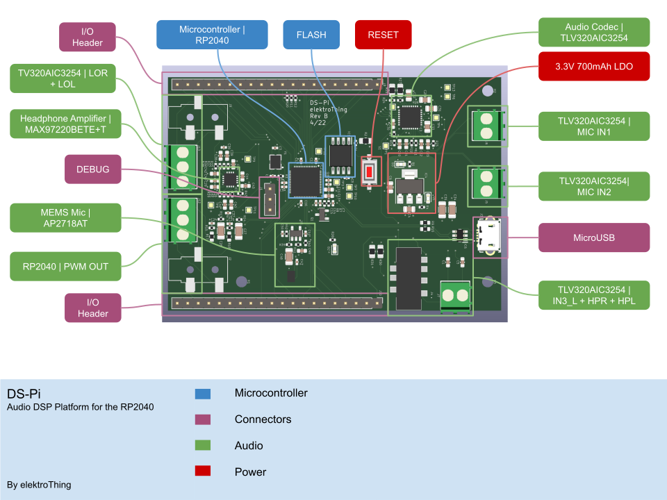

# DS-Pi - An audio DSP platform based on the Raspberry Pi RP2040

 
 The DS-Pi is an open-source RP2040-based audio digital signal processing platform that can be used to perform filtering and other DSP processes on audio inputs and outputs.
 
 This repository contains the following content;
 - Schematic
 - Code (WIP)
 
 ## What is it
The DS-Pi leverages the low cost and highly accessible platform that is the RP2040 with a powerful audio codec from Texas Instruments, the TLV320AIC3254.

The RP2040 is compatible with Arduino, Micropython and CircuitPython which makes it accessible to all tinkerers with an interest in audio signal processing.

Key Features;
- Raspberry Pi RP2040 Microcontroller
- TI TLV320AIC3254, Very Low-Power Stereo Audio CODEC with programmable miniDSP
- On-board MAX97220BETE+T Headphone Amplifier
- 3.5mm connectors for inputs and outputs as well as screw terminals for rapid prototyping
- Fully functional header outputs - same as Pi Pico

## Use cases
### Guitar FX
Standing on the shoulders of giants, one of the aims of this project is to make the platform fully compatible with the work that [Blackaddr](https://github.com/Blackaddr/BALibrary) has worked on for the Teensy platform. While there might be some limitations with hardware, the dual core M0s on the RP2040 should be able to cope with some interesting processing. 
### Customisable Guitar Amp Modeler (WIP)
Driven by a personal interest/need, this platform could be used for bedroom guitarist who wants to jam into the wee hours of the evening with their headphones and hopefully an amp model that they can customise. 

## Specification
* Microcontroller | [RP2040](https://www.raspberrypi.com/documentation/microcontrollers/rp2040.html)
    * Processor | Dual-core ARM Cortex M0+ processor, flexible clock running up to 133 MHz
    * FLASH | 4MB
    * Programming | Drag & drop over USB or Serial Wire Debug (SWD)
    * I/Os | 2×SPI, 2×I2C, 2×UART, 3×12-bit ADC, 16×controllable PWM channels
    * 8×Programmable IO (PIO) state machines for custom peripheral support
* Audio Codec | [TLV320AIC3254](https://www.ti.com/product/TLV320AIC3254)
    * Headphone Amp | [MAX97220BETE+T](http://datasheets.maximintegrated.com/en/ds/MAX97220A-MAX97220E.pdf)
* Connectors
    * MicroUSB | Programming/UART
    * Microphone Input | 2x Screw Terminals
    * Headphone Input & Output | 1x 4-Conductor 3.5mm Female & Screw Terminal
    * Line Out | 1x 3-Conductor 3.5mm Female & Screw Terminal
    * PWM Out | 1x 3-Conductor 3.5mm Female & Screw Terminal
    * Headers | 2x Headers featuring standard pinouts from [Raspberry Pi Pico](https://www.raspberrypi.com/documentation/microcontrollers/raspberry-pi-pico.html) 
* Power | 1A 3.3V LDO - AMS1117
* Mounting Options | 3x M.2.Screws

## License

MIT License

Copyright (c) 2022 elektroThing

Permission is hereby granted, free of charge, to any person obtaining a copy
of this software and associated documentation files (the "Software"), to deal
in the Software without restriction, including without limitation the rights
to use, copy, modify, merge, publish, distribute, sublicense, and/or sell
copies of the Software, and to permit persons to whom the Software is
furnished to do so, subject to the following conditions:

The above copyright notice and this permission notice shall be included in all
copies or substantial portions of the Software.

THE SOFTWARE IS PROVIDED "AS IS", WITHOUT WARRANTY OF ANY KIND, EXPRESS OR
IMPLIED, INCLUDING BUT NOT LIMITED TO THE WARRANTIES OF MERCHANTABILITY,
FITNESS FOR A PARTICULAR PURPOSE AND NONINFRINGEMENT. IN NO EVENT SHALL THE
AUTHORS OR COPYRIGHT HOLDERS BE LIABLE FOR ANY CLAIM, DAMAGES OR OTHER
LIABILITY, WHETHER IN AN ACTION OF CONTRACT, TORT OR OTHERWISE, ARISING FROM,
OUT OF OR IN CONNECTION WITH THE SOFTWARE OR THE USE OR OTHER DEALINGS IN THE
SOFTWARE.
